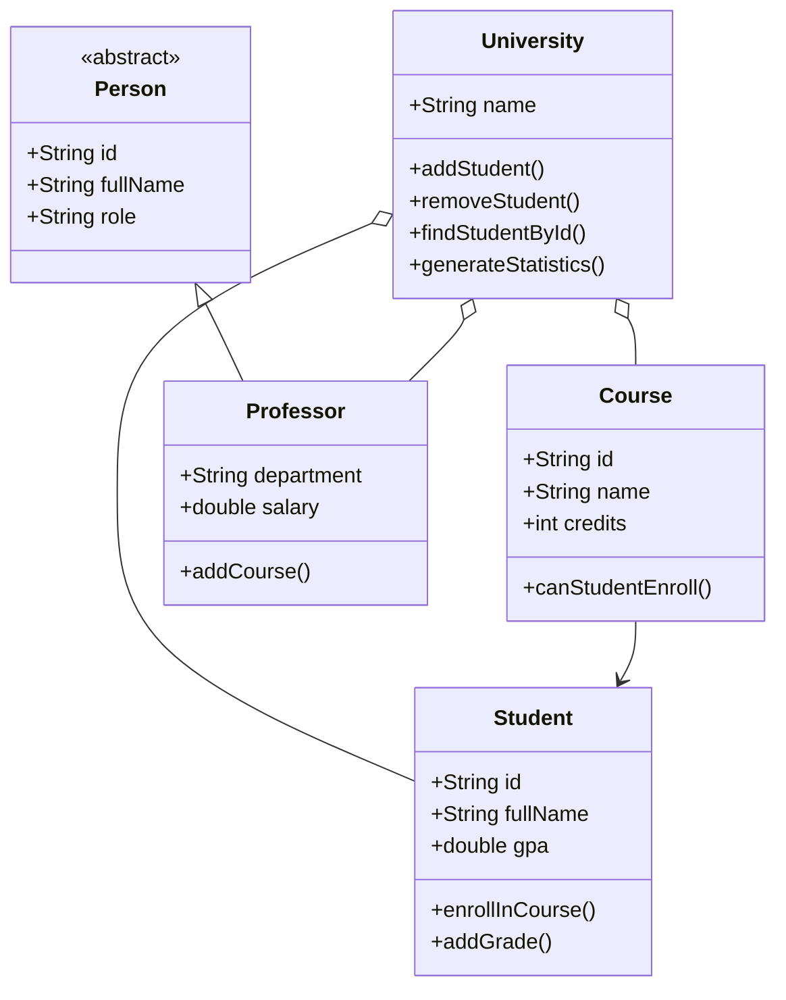

# UML-діаграма системи університету

```mermaid
classDiagram
    class Student {
        +String id
        +String fullName
        +double gpa
        +enrollInCourse()
        +addGrade()
    }

    class Course {
        +String id
        +String name
        +int credits
        +canStudentEnroll()
    }

    class Person {
        <<abstract>>
        +String id
        +String fullName
        +String role
    }

    class Professor {
        +String department
        +double salary
        +addCourse()
    }

    class University {
        +String name
        +addStudent()
        +removeStudent()
        +findStudentById()
        +generateStatistics()
    }

    Person <|-- Professor
    University o-- Student
    University o-- Professor
    University o-- Course
    Course --> Student
```